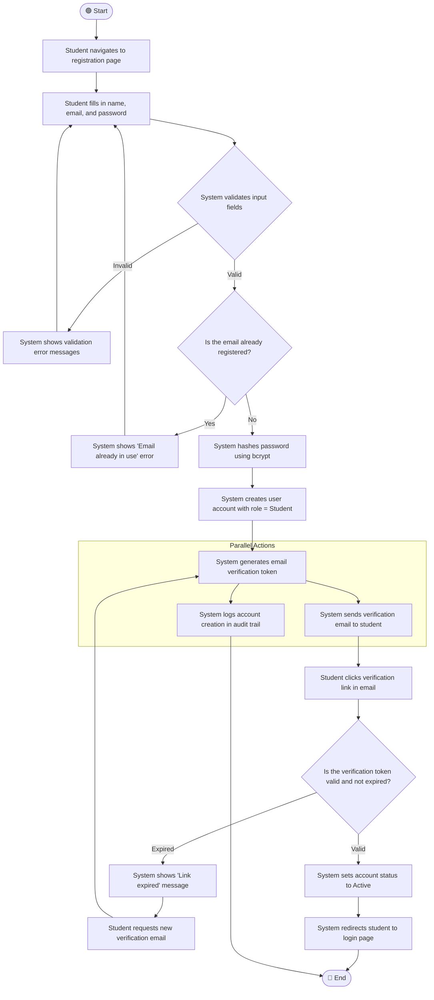
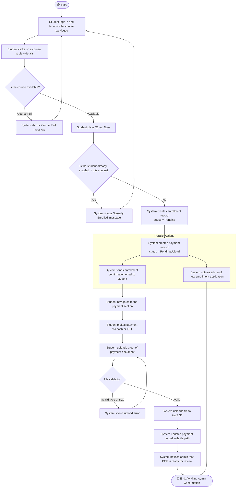
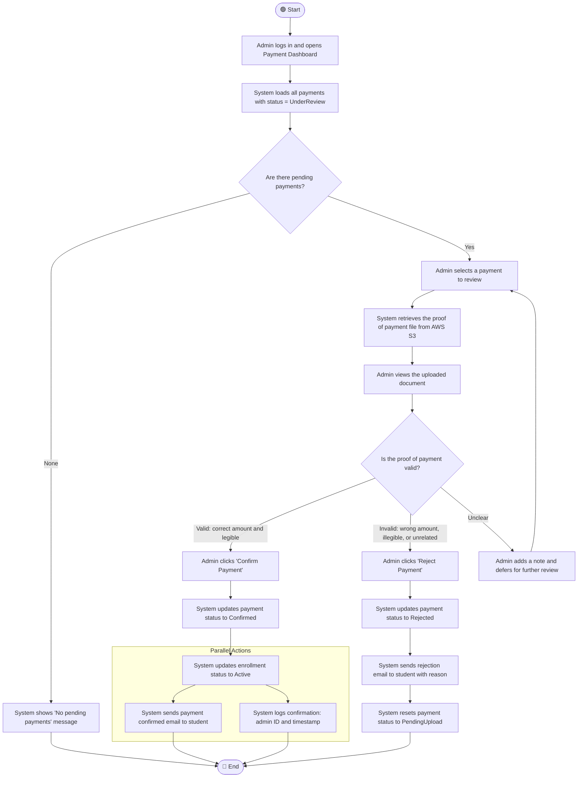
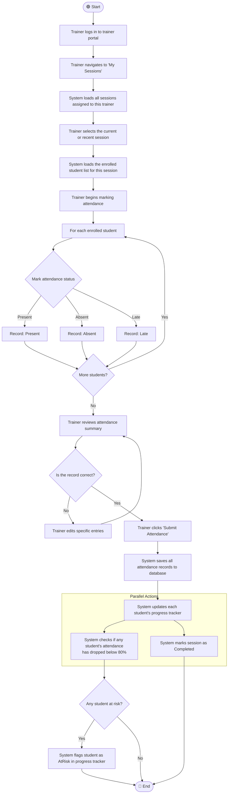
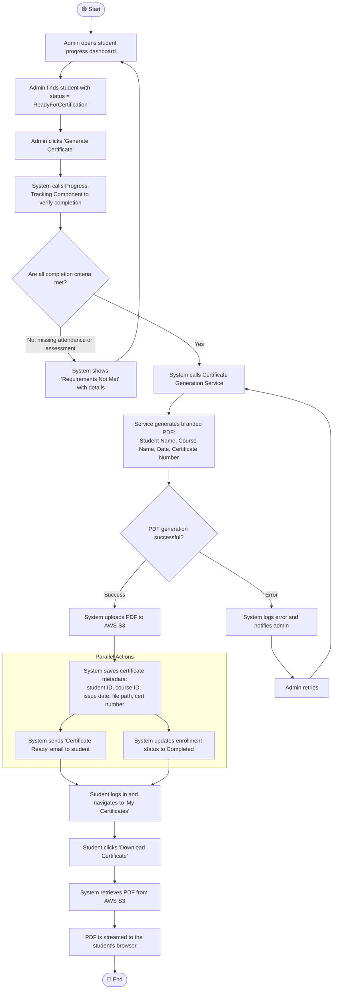
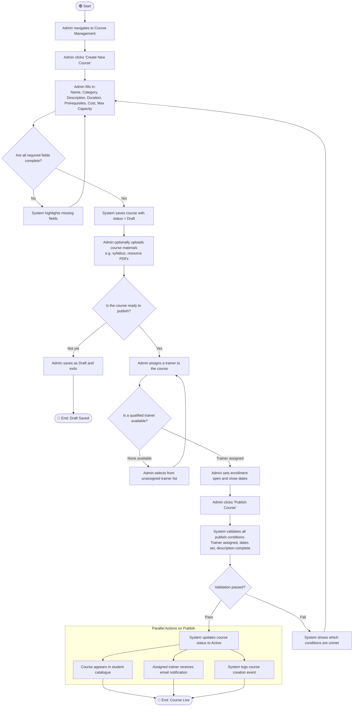
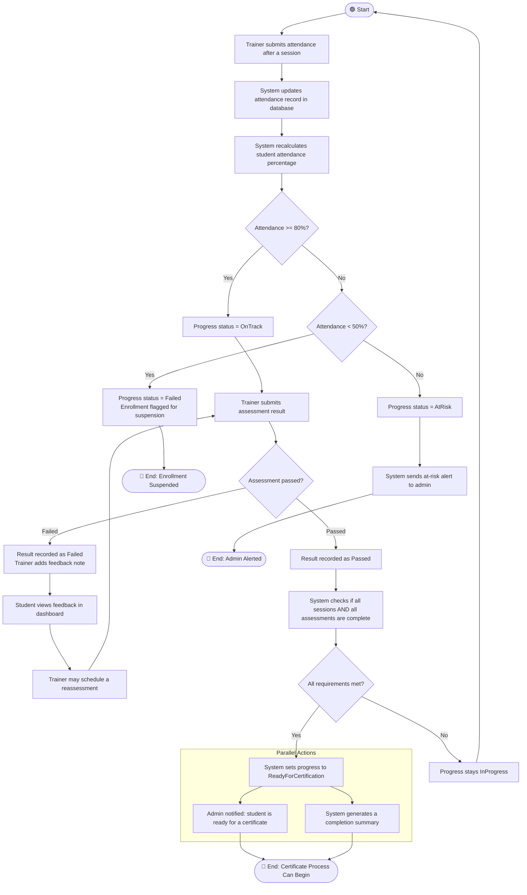
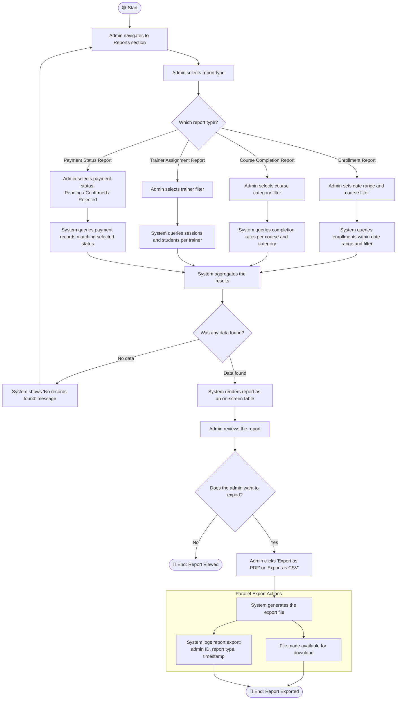

# Activity Workflow Diagrams
## Bello Beauty Academy Platform

**Document Version:** 1.0  
**Date:** March 2026  
**Status:** Draft  

---

## Table of Contents

1. [Student Registration](#1-student-registration)
2. [Course Enrollment and Payment](#2-course-enrollment-and-payment)
3. [Admin Payment Review](#3-admin-payment-review)
4. [Trainer Records Attendance](#4-trainer-records-attendance)
5. [Certificate Generation](#5-certificate-generation)
6. [Course Creation and Publishing](#6-course-creation-and-publishing)
7. [Student Progress Tracking](#7-student-progress-tracking)
8. [Admin Report Generation](#8-admin-report-generation)

---

## 1. Student Registration

### Activity Diagram

### Explanation

This workflow shows how a new student creates an account on the platform. The email verification step ensures that only people with valid email addresses can enroll in courses, which is important because the academy needs to be able to contact students.

**Key decisions in this flow:**
- The input validation loop makes sure the student fills everything in correctly before the system even tries to create an account.
- The duplicate email check prevents two accounts being created with the same address.
- The token expiry check is there because verification emails have a 24-hour window: if a student misses it, they can request a new one instead of having to register all over again.

**Parallel actions:** Sending the verification email and writing to the audit log happen at the same time, because neither one depends on the other. This avoids unnecessary waiting.

**How this addresses stakeholder concerns:** The academy admin needs to know that only verified, real students are in the system. The email verification step directly enforces this. The audit log also means there's always a record of when accounts were created, which is useful for troubleshooting.

**Functional requirement mapping:** Covers [**FR01**](SPECIFICATION.md#61-student-requirements) (student registration), [**FR02**](SPECIFICATION.md#61-student-requirements) (login after registration), and [**NFR01**](SPECIFICATION.md#71-security) (passwords hashed with bcrypt).

---

## 2. Course Enrollment and Payment

### Activity Diagram

### Explanation

This is probably the most important workflow in the whole system from the student's perspective. It covers everything from choosing a course to successfully submitting their proof of payment.

**Key decisions in this flow:**
- Checking if the course is full before letting the student apply saves them time and prevents data issues.
- The duplicate enrollment check means a student can't accidentally enroll in the same course twice.
- The file validation check (type and size) makes sure the admin only receives documents they can actually open and read.

**Parallel actions:** Once the enrollment record is created, the student gets a confirmation email and the admin gets an alert at the same time. This is important because neither action should depend on the other: the student shouldn't have to wait for the admin to be notified before getting their own confirmation.

**How this addresses stakeholder concerns:** Students need immediate feedback that their application was received. Admins need to know quickly so they can process payments without delay. Both are handled by the parallel notifications.

**Functional requirement mapping:** Covers [**FR05**](SPECIFICATION.md#61-student-requirements) (enrollment submission), [**FR10**](SPECIFICATION.md#61-student-requirements) (enrollment confirmation email), [**FR11**](SPECIFICATION.md#61-student-requirements) (payment status visibility), and [**FR12**](SPECIFICATION.md#61-student-requirements) (proof of payment upload).

---

## 3. Admin Payment Review

### Activity Diagram

### Explanation

This workflow is from the admin's side. After a student uploads their proof of payment, the admin needs a clear process for reviewing it, confirming or rejecting it, and making sure the student is notified either way.

**Key decisions in this flow:**
- A three-way decision on payment validity (valid, invalid, unclear) is included because in practice not every document is obviously correct or wrong: sometimes the admin needs to look more carefully before deciding.
- The deferred review path (`Unclear → defer`) prevents the admin from making a rushed incorrect decision.

**Parallel actions:** After a payment is confirmed, the student email and the audit log entry happen at the same time. The audit log is important for financial accountability: the academy needs to know exactly which admin confirmed which payment and when.

**How this addresses stakeholder concerns:** The academy owner needs a trustworthy financial record. The parallel logging ensures every confirmation is tracked even if the email fails to send. Students need fast communication after payment: the immediate notification addresses this.

**Functional requirement mapping:** Covers [**FR24**](SPECIFICATION.md#63-administrator-requirements) (admin payment dashboard), [**FR25**](SPECIFICATION.md#63-administrator-requirements) (confirm or reject payment), [**FR26**](SPECIFICATION.md#63-administrator-requirements) (manually record cash payments), and [**FR27**](SPECIFICATION.md#63-administrator-requirements) (email notification on confirmation).

---

## 4. Trainer Records Attendance

### Activity Diagram

### Explanation

This workflow shows what happens when a trainer submits attendance after a training session. It also shows how the system automatically acts on that data.

**Key decisions in this flow:**
- The three-way attendance choice (Present, Absent, Late) is important because just marking someone as present or absent isn't enough: being late affects the student's progress record differently.
- The review step before submission lets the trainer fix any mistakes before the data is saved permanently.
- The at-risk check after submission is automated: the system doesn't rely on the trainer to identify struggling students manually.

**Parallel actions:** After attendance is submitted, two things happen at the same time: the at-risk check runs on each student and the session gets marked as `Completed`. These don't need to wait for each other.

**How this addresses stakeholder concerns:** The academy needs early warnings about students who might not pass. The automated at-risk detection means management is alerted even if the trainer doesn't notice the pattern. The review step protects against accidental errors in the attendance record.

**Functional requirement mapping:** Covers [**FR15**](SPECIFICATION.md#62-trainer-requirements) (trainers record attendance), [**FR08**](SPECIFICATION.md#61-student-requirements) (students can view their attendance records), and feeds into the `AtRisk` state from my state diagram in `STATE_DIAGRAMS.md`.

---

## 5. Certificate Generation

### Activity Diagram

### Explanation

This workflow covers the full certificate process from the admin triggering it to the student downloading the PDF. The eligibility check at the beginning ensures that the system never generates a certificate for a student who has not actually finished the course.

**Key decisions in this flow:**
- The completion criteria check at the start is a hard gate: no certificate gets created unless the student genuinely qualifies.
- The PDF generation failure path is important for reliability: if the PDF service crashes or times out, the admin gets notified and can retry without having to start the whole process from scratch.

**Parallel actions:** Once the certificate metadata is saved, the student gets an email and the enrollment is updated to `Completed` at the same time. Neither depends on the other so there's no reason to wait.

**How this addresses stakeholder concerns:** The academy's reputation depends on certificates being meaningful: only graduates who actually completed the work should receive them. The eligibility gate enforces this. The parallel email means students don't have to check back: they're told immediately.

**Functional requirement mapping:** Covers [**FR22**](SPECIFICATION.md#63-administrator-requirements) (admin generates certificates) and [**FR09**](SPECIFICATION.md#61-student-requirements) (students download their PDF certificate). Connects to the Certificate state diagram in `STATE_DIAGRAMS.md`.

---

## 6. Course Creation and Publishing

### Activity Diagram

### Explanation

This workflow shows how an admin creates a new course and gets it live on the platform. A draft stage is included because courses often need to be prepared over multiple sessions before they are ready to go public.

**Key decisions in this flow:**
- The required fields check at the beginning stops half-complete courses being saved in a confusing state.
- The trainer availability check is important: a course shouldn't go live without someone assigned to teach it.
- The final publish validation is a last check before the course becomes visible to students.

**Parallel actions on publish:** Three things happen at the same time when a course is published: it appears in the student catalogue, the trainer gets an email, and the event is logged. All three are independent so they can happen in parallel.

**How this addresses stakeholder concerns:** The academy can't afford to have students enrolling in courses that aren't properly set up. The multi-step validation prevents that. Trainers also need to know about new courses as soon as they're published: the parallel notification makes sure they're informed immediately.

**Functional requirement mapping:** Covers [**FR18**](SPECIFICATION.md#63-administrator-requirements) (admin creates and manages courses), [**FR19**](SPECIFICATION.md#63-administrator-requirements) (admin assigns trainers), and [**FR03**](SPECIFICATION.md#61-student-requirements) (students browse only live, active courses).

---

## 7. Student Progress Tracking

### Activity Diagram

### Explanation

This workflow shows what happens after a trainer submits attendance and an assessment: how the system processes that data and updates the student's progress accordingly. A reassessment loop is included because in a real training environment students sometimes fail an assessment the first time and are given a second chance.

**Key decisions in this flow:**
- The three-tier attendance check (>=80%, between 50–80%, below 50%) matches the three states in my student progress state diagram: `OnTrack`, `AtRisk`, and `Failed`.
- The failed assessment loop with feedback notes is realistic: trainers should be able to give students guidance before a reassessment.

**Parallel actions:** When a student reaches `ReadyForCertification`, the admin gets notified and a completion summary is generated at the same time. Both are triggered by the same event but don't depend on each other.

**How this addresses stakeholder concerns:** Trainers need to know their submission has an effect: seeing the at-risk flag update in real time gives them confidence the system is working. Academy management needs early warnings about failing students to intervene before it's too late. The automated threshold check does exactly that.

**Functional requirement mapping:** Covers [**FR08**](SPECIFICATION.md#61-student-requirements) (students view progress), [**FR15**](SPECIFICATION.md#62-trainer-requirements) (trainers record attendance), [**FR16**](SPECIFICATION.md#62-trainer-requirements) (trainers submit assessments), and sets up the precondition for [**FR22**](SPECIFICATION.md#63-administrator-requirements) (certificate generation).

---

## 8. Admin Report Generation

### Activity Diagram

### Explanation

This workflow shows how an admin generates and optionally exports an operational report. Four different report types are included because the academy has different reporting needs: enrollment numbers, course completion, trainer workload, and payment status are all separate concerns.

**Key decisions in this flow:**
- The four-way report type split reflects these different needs: each type runs a different database query with different filters.
- The "no data found" check is important so the admin gets useful feedback rather than just an empty table with no explanation.
- The export decision is optional: not every report needs to be downloaded, sometimes the admin just needs to check something on screen.

**Parallel export actions:** When a report is exported, the file is made available for download and the export is logged at the same time. The log is there for accountability: the academy should know when reports were generated and by whom.

**How this addresses stakeholder concerns:** Academy management needs real operational data to make decisions about which courses to run, which trainers are overloaded, and whether students are progressing. Having four report types with flexible filters means management can answer specific questions without digging through the entire database. The audit log on exports also supports governance requirements.

**Functional requirement mapping:** Covers [**FR23**](SPECIFICATION.md#63-administrator-requirements) (admin generates reports on enrollments, completions, and trainer assignments) and [**FR24**](SPECIFICATION.md#63-administrator-requirements) (payment dashboard: addressed by the Payment Status Report type).