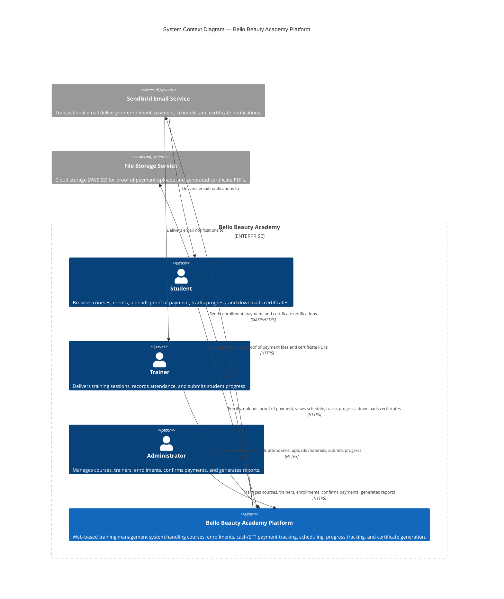
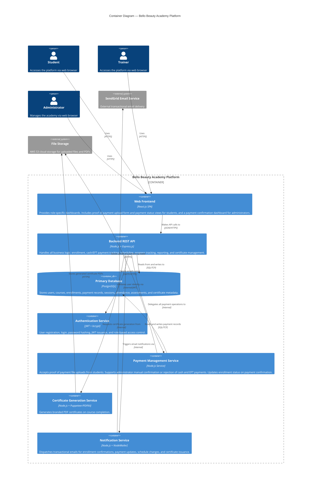
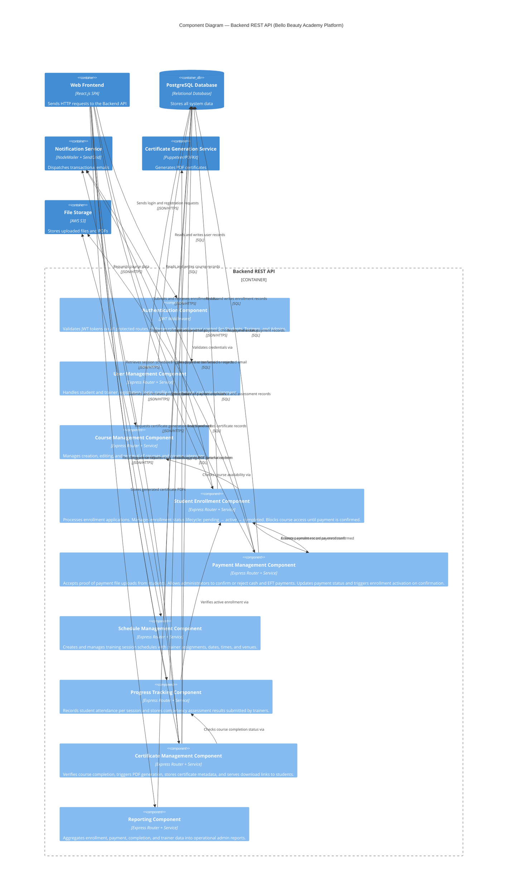

# Software Architecture Document : Bello Beauty Academy Platform

**Document Version:** 1
**Date:** March 2026
**Status:** Draft

---

## Table of Contents

1. [Architecture Overview](#1-architecture-overview)
2. [Architecture Style](#2-architecture-style)
3. [Software Design Principles](#3-software-design-principles)
4. [System Components](#4-system-components)
5. [C4 Level 1 — System Context Diagram](#5-c4-level-1--system-context-diagram)
6. [C4 Level 2 — Container Diagram](#6-c4-level-2--container-diagram)
7. [C4 Level 3 — Component Diagram](#7-c4-level-3--component-diagram)
8. [Data Flow Description](#8-data-flow-description)
9. [Technology Stack](#9-technology-stack)
10. [Database Schema Overview](#10-database-schema-overview)

---

## 1. Architecture Overview

The **Bello Beauty Academy Platform** is designed as a modern, **layered web application** following a client-server model. The system separates concerns clearly across the presentation layer, business logic layer, and data layer. This separation ensures that each component can be developed, tested, and maintained independently.

The architecture prioritises:

- **Separation of Concerns** — the frontend, backend API, and database are independently deployable units
- **Role-Based Access Control** — each user role (Student, Trainer, Administrator) has strictly scoped access
- **Service Isolation** — specialised functions such as payment tracking, certificate generation, and email notifications are handled by dedicated services
- **Scalability** — the containerised deployment model supports horizontal scaling
- **Security** — all inter-service communication is authenticated and encrypted

---

## 2. Architecture Style

The system adopts a **modular monolith backend** architecture for this first version. The backend API is structured as a single deployable application with clearly separated internal modules. This approach keeps the codebase maintainable and can be evolved into microservices in future iterations.

**Architecture pattern:** Layered MVC (Model-View-Controller) with service layer
**API style:** RESTful HTTP API
**Frontend pattern:** Single Page Application (SPA)

---

## 3. Software Design Principles

The Bello Beauty Academy Platform is designed in accordance with established software engineering principles to ensure a maintainable, scalable, and robust system.

### 3.1 Core Design Principles

**Separation of Concerns** — The system is divided into clearly distinct layers: presentation (React frontend), business logic (Node.js API), and data persistence (PostgreSQL). Each layer is independently maintainable.

**High Cohesion, Low Coupling** — Each internal module is tightly focused on its own domain. Modules communicate through well-defined internal interfaces, minimising interdependency and making individual components easier to test and replace.

**Role-Based Access Control (RBAC)** — Security concerns are separated from business logic. The Authentication Component enforces access rules at the API boundary, ensuring each user role only accesses the features relevant to them.

### 3.2 Agile Principles in Architectural Design

The architecture has been approached using agile thinking to ensure flexibility and responsiveness to changing requirements:

- **Incremental design** — The system is designed in clearly scoped increments. Core features (enrollment, scheduling, progress tracking) form the first release, with enhancements such as online payments planned as future iterations.
- **Evolutionary architecture** — The modular monolith is deliberately structured so that individual modules can be extracted into independent microservices as the system grows, without requiring a full redesign.
- **Continuous feedback alignment** — The separation of the frontend and backend allows the UI to be iterated independently based on user feedback, without changes to the underlying API.
- **Adaptive scope** — The Future Scope section of the specification captures features that have been identified and designed but deliberately deferred, reflecting the agile principle of managing scope incrementally rather than committing to everything upfront.

---

## 4. System Components

### 3.1 Frontend Web Application

A **React.js Single Page Application (SPA)** that provides the user interface for all three user roles — Students, Trainers, and Administrators. The frontend communicates with the backend exclusively via the REST API over HTTPS. It renders role-specific dashboards and views based on the authenticated user's role, including a proof of payment upload form and a payment status view.

### 3.2 Backend REST API

A **Node.js + Express.js** application serving as the core of the system. All business logic is organised into the following internal modules:

- **User Management Module** — registration, login, and profile management
- **Course Management Module** — CRUD operations for courses and categories
- **Student Enrollment Module** — enrollment lifecycle management; blocks course access until payment is confirmed
- **Payment Management Module** — tracks payment status, handles proof of payment uploads, and supports admin manual confirmation for cash and EFT payments
- **Schedule Management Module** — training session scheduling and trainer assignment
- **Progress Tracking Module** — attendance and competency assessment records
- **Certificate Generation Module** — PDF certificate generation and issuance
- **Notification Module** — transactional email dispatch

### 3.3 Database

A **PostgreSQL** relational database persisting all system data: users, courses, enrollments, payments, sessions, attendance, assessments, certificates, and course materials.

### 3.4 Authentication Service

A **JWT-based authentication service** embedded in the backend. Handles registration, login, password hashing (bcrypt), token issuance, token validation, and role-based access enforcement on every protected API endpoint.

### 3.5 Payment Management Service

A dedicated internal service managing all payment-related operations. The current version supports the following payment flow:

**Cash / EFT (Admin-Confirmed)**
The student uploads a proof of payment document (bank slip or EFT screenshot) through the platform after making payment. The administrator reviews the uploaded document on the payment dashboard and confirms or rejects it. On confirmation, the enrollment is automatically activated and the student receives an email notification.

> **Planned Future Enhancement:** Online card payment via the PayFast payment gateway is planned for a future release. See [FUTURE_ENHANCEMENTS.md](./FUTURE_ENHANCEMENTS.md) for the full design of this feature.

In both the current and future flows, enrollment status moves from `pending` to `active` only once payment is confirmed.

### 3.6 Certificate Generation Service

A **PDF generation service** using Puppeteer or PDFKit. Generates branded PDF certificates containing the student's name, course name, completion date, and a unique certificate number. PDFs are stored in file storage and made available for student download.

### 3.7 Notification Service

An **email notification service** using NodeMailer and SendGrid. Dispatches:
- Enrollment received confirmation
- Payment confirmation notification
- Payment rejection notice prompting POP resubmission
- Schedule update alerts to students and trainers
- Certificate ready notification

---

## 5. C4 Level 1 — System Context Diagram



---

## 6. C4 Level 2 — Container Diagram



---

## 7. C4 Level 3 — Component Diagram



---

## 8. Data Flow Description

### 7.1 Student Enrollment and Payment Flow (Cash / EFT)

```
1. Student submits enrollment
   → POST /api/enrollments
   → Authentication Component: validates JWT
   → Enrollment Component: creates enrollment (status = "pending")
   → Payment Component: creates payment record (method = "cash/eft", status = "pending")
   → Notification Service → Email to Student:
     "Enrollment received. Please make payment and upload your proof of payment."

2. Student uploads proof of payment (bank slip or EFT screenshot)
   → POST /api/payments/{enrollmentId}/upload
   → Payment Component: saves file to AWS S3, updates payment record with file path
   → Notification Service → Email to Admin:
     "New proof of payment uploaded. Please review."

3. Admin opens Payment Dashboard
   → GET /api/payments?status=pending
   → Payment Component: returns list of pending payments with POP download links
   → Admin clicks "View POP" → file retrieved from S3 for review

4a. Admin confirms payment
   → POST /api/payments/{paymentId}/confirm
   → Payment Component: updates payment status = "confirmed",
     records confirmed_by and confirmed_at
   → Enrollment Component: updates enrollment status = "active"
   → Notification Service → Email to Student:
     "Payment confirmed. Your enrollment is now active."

4b. Admin rejects payment
   → POST /api/payments/{paymentId}/reject
   → Payment Component: updates payment status = "rejected"
   → Notification Service → Email to Student:
     "Payment could not be verified. Please resubmit your proof of payment."
```

### 7.2 Admin Payment Dashboard Flow

```
Admin → Payment Dashboard
→ GET /api/payments?status=pending    → cash/EFT payments awaiting review
→ GET /api/payments?status=confirmed  → all confirmed payments
→ GET /api/payments/{id}/proof        → retrieve uploaded POP file from S3
→ POST /api/payments/{id}/confirm     → confirm → enrollment activated
→ POST /api/payments/{id}/reject      → reject → student notified to resubmit
```

### 7.3 Certificate Generation Flow

```
1. Admin → POST /api/certificates/{studentId}/{courseId}
   → Authentication Component: validates admin JWT
   → Certificate Component → Progress Tracker: verifies course completion
   → Certificate Generation Service: generates branded PDF
   → File Storage (S3): stores PDF
   → Database: stores certificate metadata and file path
   → Notification Service → Email to Student: "Your certificate is ready to download."

2. Student → GET /api/certificates/download/{certId}
   → Certificate Component: retrieves PDF from S3
   → PDF streamed to student browser for download
```

### 7.4 Payment Status Lifecycle

```
Student Enrolls
       │
       ▼
 Payment: PENDING
 (Student uploads proof of payment)
       │
       ▼
 Admin Reviews POP
       │
   ┌───┴───┐
   ▼       ▼
CONFIRMED  REJECTED ──► Student notified to resubmit
   │
   ▼
Enrollment: ACTIVE
   │
   ▼
Student attends training sessions
   │
   ▼
Course Completed
   │
   ▼
Certificate Issued
```

---

## 9. Technology Stack

| Layer | Technology | Justification |
|-------|------------|---------------|
| Frontend | React.js | Component-based SPA; role-specific routing and dashboards |
| Styling | Tailwind CSS | Utility-first CSS for consistent, responsive UI |
| Backend | Node.js + Express.js | Full-stack JavaScript; lightweight REST API framework |
| Database | PostgreSQL | Robust relational DB with referential integrity constraints |
| Authentication | JWT + bcrypt | Stateless token auth; secure password hashing |
| File Storage | AWS S3 | Scalable cloud storage for POP uploads and certificate PDFs |
| Certificate Generation | Puppeteer / PDFKit | HTML-to-PDF rendering for branded certificates |
| Email Notifications | NodeMailer + SendGrid | Reliable transactional email delivery |
| Containerisation | Docker + Docker Compose | Reproducible dev and deployment environments |
| Version Control | Git + GitHub | Source control and project documentation |

---

## 10. Database Schema Overview

| Table | Description |
|-------|-------------|
| `users` | All platform users with role: student, trainer, admin |
| `course_categories` | Lash, Brow, Nail, Makeup |
| `courses` | Training courses with category, description, duration, and status |
| `trainers` | Trainer profiles linked to user accounts |
| `enrollments` | Student-to-course records; status: pending, active, completed |
| `payments` | One payment record per enrollment: method (cash/eft), status, POP file path, confirming admin |
| `sessions` | Scheduled training sessions with trainer, date, time, and venue |
| `attendance` | Per-session attendance: present, absent, late |
| `assessments` | Competency assessment results per student per course |
| `certificates` | Issued certificates with student, course, issue date, and PDF path |
| `course_materials` | Uploaded course documents linked to courses |
| `notifications` | Log of all dispatched email notifications |

---

*End of ARCHITECTURE.md*