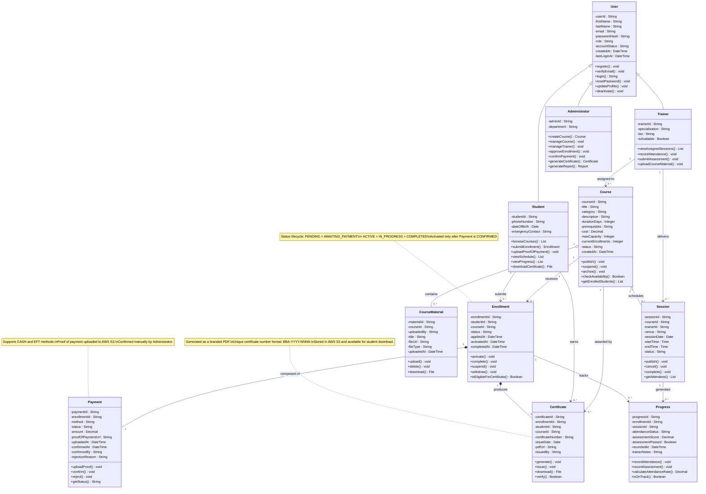

# Class Diagram
## Bello Beauty Academy Platform

**Document Version:** 1.0
**Date:** March 2026
**Status:** Draft

---

## Table of Contents

1. [Class Diagram](#1-class-diagram)
2. [Design Decisions](#2-design-decisions)

---

## 1. Class Diagram

The following Mermaid.js class diagram represents the full object-oriented structure of the Bello Beauty Academy Platform. It includes all seven core domain entities with their attributes, methods, relationships, and multiplicities. All four UML relationship types are represented: inheritance, association, aggregation, and composition.

---

## 2. Design Decisions

### 2.1 Inheritance: User as the Base Class

`User` is designed as a base class with three specialised subclasses: `Student`, `Trainer`, and `Administrator`. This decision reflects the fact that all three roles share a common identity and authentication model. Every person on the platform has an email address, a hashed password, an account status, and a role. Rather than duplicating these attributes across three separate, unrelated classes, inheritance keeps the common data in one place and allows each subclass to extend it with role-specific attributes and behaviours.

This aligns directly with [NFR03](SPECIFICATION.md#71-security) (role-based access control), where the `role` attribute on the base `User` class is what the authentication middleware reads to enforce access boundaries at the API level.

### 2.2 Composition: Payment and Certificate within Enrollment

`Payment` and `Certificate` are modelled using **composition** with `Enrollment`. This means neither can exist independently of an `Enrollment` record.

A `Payment` record is created automatically at the moment an enrollment is submitted. It has no meaning outside the context of that enrollment. If the enrollment is removed, the payment record has no parent to belong to. Composition correctly captures this lifecycle dependency.

Similarly, a `Certificate` is the final output of a completed enrollment. It cannot be generated without a valid, completed enrollment to reference. Composition makes this constraint explicit in the model and enforces it at the structural level.

### 2.3 Aggregation: Session and CourseMaterial within Course

`Session` and `CourseMaterial` are modelled using **aggregation** with `Course`. Unlike composition, aggregation represents a "has-a" relationship where the child can exist or be managed independently of the parent.

A `Session` is part of a course's delivery schedule, but sessions can be cancelled, rescheduled, or reassigned without the course itself being affected. A `CourseMaterial` file can be deleted or replaced without removing the course. This weaker ownership relationship is correctly represented by aggregation rather than composition.

### 2.4 Separating Progress from Enrollment

`Progress` could have been modelled as a set of attributes directly on `Enrollment`. However, progress is recorded per session, meaning a student can attend or miss each individual session separately. This required a separate entity with a relationship to both `Enrollment` and `Session`, allowing the system to store granular attendance and assessment records for every session a student attends. This structure is what drives the automated at-risk detection described in the state diagrams in [STATE_DIAGRAMS.md](./STATE_DIAGRAMS.md).

### 2.5 Notes in the Diagram

Notes have been added to the three most behaviourally complex entities (`Enrollment`, `Payment`, and `Certificate`) to provide inline clarification of key constraints and business rules without cluttering the class definitions themselves. This is particularly useful for the `Enrollment` status lifecycle, which spans eight distinct states and would be difficult to infer from the class definition alone.

### 2.6 Multiplicity Summary

| Relationship | Multiplicity | Reasoning |
|-------------|-------------|-----------|
| `Student` to `Enrollment` | `1` to `0..*` | A student may have no enrollments yet, or many across different courses |
| `Course` to `Enrollment` | `1` to `0..*` | A course may have no enrollments yet, or many active students |
| `Enrollment` to `Payment` | `1` to `1` | Every enrollment has exactly one payment record, no more and no less |
| `Enrollment` to `Certificate` | `1` to `0..1` | An enrollment produces at most one certificate, and only upon completion |
| `Trainer` to `Session` | `1` to `0..*` | A trainer may be assigned to multiple sessions; each session has one trainer |
| `Course` to `Session` | `1` to `0..*` | A course consists of multiple scheduled sessions over its duration |
| `Course` to `CourseMaterial` | `1` to `0..*` | A course can have many uploaded materials |
| `Enrollment` to `Progress` | `1` to `0..*` | An enrollment accumulates one progress record per session attended |

### 2.7 Assumptions

- `Session` is distinct from `Course`. A course is the programme definition; sessions are the individual scheduled class meetings that make up that course's delivery.
- The `Administrator` class does not hold a direct object reference to confirmed payments. Confirmation is tracked on the `Payment` entity via the `confirmedBy` attribute, which stores the administrator's user ID. This avoids tight coupling between `Administrator` and `Payment`.
- `CourseMaterial` records the `uploadedBy` attribute as a String (user ID) rather than a direct object reference, to preserve traceability without introducing an additional relationship line into the diagram.