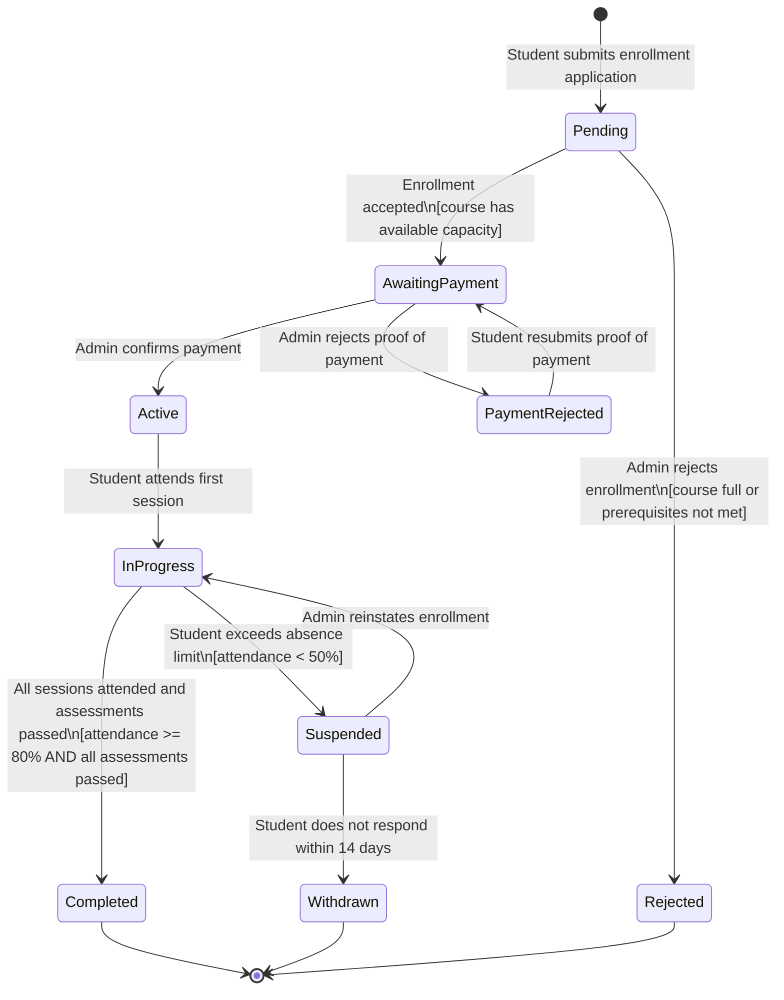
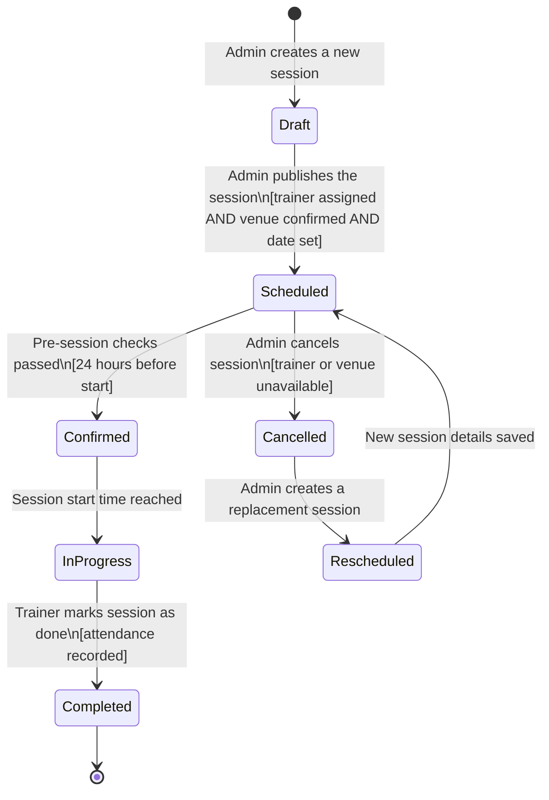
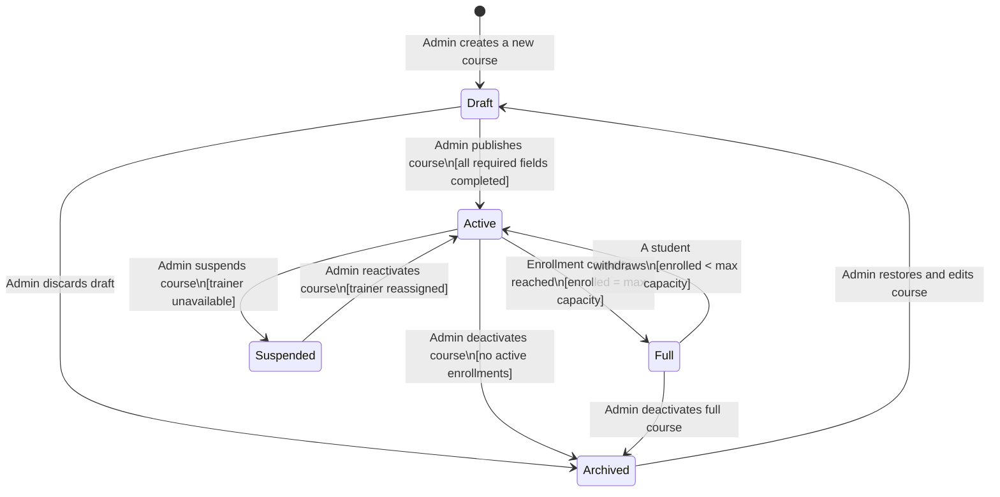
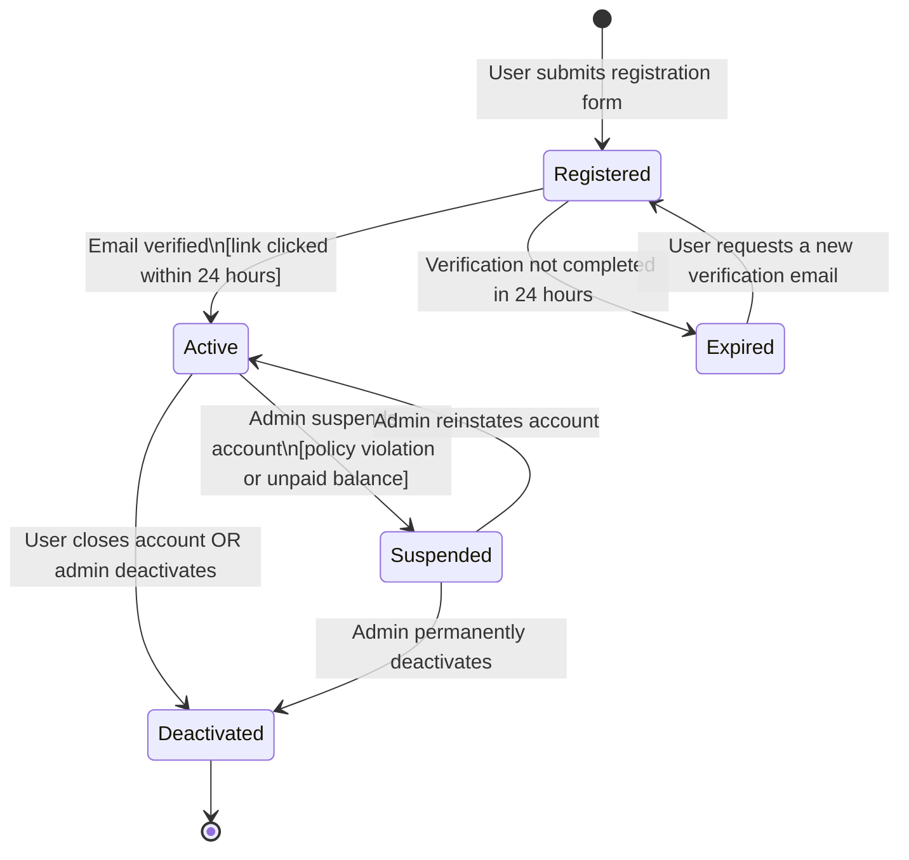

```mermaid
stateDiagram-v2
    [*] --> Created : Enrollment record created
    Created --> PendingUpload : System waits for student to upload proof
    PendingUpload --> UnderReview : Student uploads proof of payment
    UnderReview --> Confirmed : Admin verifies and confirms payment\n[document is valid and amount is correct]
    UnderReview --> Rejected : Admin rejects the document\n[illegible, wrong amount, or wrong reference]
    Rejected --> PendingUpload : Student is notified to upload again
    Confirmed --> [*] : Enrollment activated; student notified by email
```

```mermaid
stateDiagram-v2
    [*] --> EligibilityPending : Course marked as completed
    EligibilityPending --> EligibilityVerified : Progress checks pass\n[attendance >= 80% AND all assessments passed]
    EligibilityPending --> EligibilityFailed : Requirements not met\n[attendance too low OR assessment incomplete]
    EligibilityVerified --> GenerationRequested : Admin triggers certificate generation
    GenerationRequested --> Generating : Certificate Generation Service starts
    Generating --> Generated : PDF created and stored in S3
    Generating --> GenerationFailed : Error during PDF creation
    GenerationFailed --> GenerationRequested : Admin retries
    Generated --> Issued : Admin issues certificate\n[metadata saved; student notified]
    Issued --> Downloaded : Student downloads the PDF
    Downloaded --> [*]
```

```mermaid
stateDiagram-v2
    [*] --> NotStarted : Enrollment becomes Active
    NotStarted --> InProgress : Student attends first session
    InProgress --> OnTrack : Attendance >= 80% AND assessments up to date
    InProgress --> AtRisk : Attendance drops below 80% OR assessment overdue
    AtRisk --> OnTrack : Student catches up\n[attendance restored >= 80%]
    AtRisk --> Failed : Attendance below 50% AND assessment not done
    OnTrack --> ReadyForCertification : All sessions done AND all assessments passed
    ReadyForCertification --> Certified : Certificate issued by admin
    Failed --> [*] : Progress closed; enrollment suspended
    Certified --> [*]
```

```mermaid
stateDiagram-v2
    [*] --> Awaited : Payment record created with enrollment
    Awaited --> Uploaded : Student uploads document\n[file type = PDF/JPG/PNG AND size <= 5MB]
    Uploaded --> UnderReview : Admin opens payment dashboard
    UnderReview --> Approved : Admin verifies document as valid
    UnderReview --> Rejected : Admin flags document as invalid\n[wrong amount, illegible, or wrong reference]
    Rejected --> Awaited : Student notified to upload a new document
    Approved --> [*] : Payment confirmed; enrollment activated
```

# State Transition Diagrams
## Bello Beauty Academy Platform

**Document Version:** 1.0  
**Date:** March 2026  
**Status:** Draft  

---

## Table of Contents

1. [Student Enrollment](#1-student-enrollment)
2. [Payment](#2-payment)
3. [Training Session](#3-training-session)
4. [Certificate](#4-certificate)
5. [Course](#5-course)
6. [User Account](#6-user-account)
7. [Student Progress](#7-student-progress)
8. [Proof of Payment Document](#8-proof-of-payment-document)

---

## 1. Student Enrollment

The enrollment object is the heart of the whole system. Almost everything else: payments, progress, certificates: depends on the enrollment being in the right state. Without careful modeling here, the system could end up giving students access to courses they have not paid for yet, or generating certificates for people who are not properly enrolled.

### State Transition Diagram

### Key States and Transitions

| State | What it means |
|-------|--------------|
| **Pending** | The student applied but the system hasn't processed it yet |
| **AwaitingPayment** | Application accepted: waiting for the student to pay and upload their slip |
| **PaymentRejected** | The slip the student uploaded was invalid: they need to try again |
| **Active** | Payment confirmed: student can access all course materials and sessions |
| **InProgress** | Student has attended at least one session and is actively training |
| **Completed** | All attendance and assessments are done: ready for a certificate |
| **Suspended** | Student missed too many sessions and their enrollment has been paused |
| **Withdrawn** | Student never responded after being suspended: they've been removed |
| **Rejected** | Admin turned down the application at the start |

**How this maps to functional requirements:**
- The move from `Pending` to `AwaitingPayment` is what [**FR05**](SPECIFICATION.md#61-student-requirements) describes: students submit enrollment applications.
- The `AwaitingPayment → Active` transition only happens when the admin confirms payment ([**FR25**](SPECIFICATION.md#63-administrator-requirements)), and the student gets an email when it happens ([**FR27**](SPECIFICATION.md#63-administrator-requirements)).
- `Completed` is the state that allows [**FR09**](SPECIFICATION.md#61-student-requirements) to work: students can only download a certificate once they reach this state.
- The `PaymentRejected` cycle handles [**FR12**](SPECIFICATION.md#61-student-requirements): students can upload proof of payment, and if it's rejected they can try again.

---

## 2. Payment

The payment object is modeled separately from enrollment because the payment has its own lifecycle. The enrollment tracks whether the student is active in a course, while the payment tracks whether the money has actually been verified. Separating these two makes the admin's payment dashboard much easier to reason about.

### State Transition Diagram

### Key States and Transitions

| State | What it means |
|-------|--------------|
| **Created** | A payment record is automatically created when a student enrolls |
| **PendingUpload** | Waiting for the student to upload their bank slip or EFT screenshot |
| **UnderReview** | The student uploaded a document: the admin can now review it |
| **Confirmed** | The admin checked it and it's valid: enrollment gets activated |
| **Rejected** | The document didn't pass: wrong amount, unreadable, or wrong reference |

**Guard conditions:**
- The transition to `Confirmed` only happens if the document is readable and the amount is correct.
- Once rejected, the payment automatically goes back to `PendingUpload` and the student gets an email.

**How this maps to functional requirements:**
- `PendingUpload → UnderReview` is [**FR12**](SPECIFICATION.md#61-student-requirements) in action: students uploading proof of payment.
- `UnderReview → Confirmed` is [**FR25**](SPECIFICATION.md#63-administrator-requirements): admin confirms payment.
- `UnderReview → Rejected` and `Rejected → PendingUpload` are both covered by [**FR25**](SPECIFICATION.md#63-administrator-requirements) and [**FR27**](SPECIFICATION.md#63-administrator-requirements).

---

## 3. Training Session

Sessions need careful modeling because a lot of things can happen to them: a trainer might become unavailable, a venue might fall through, or a session might need to be rescheduled. Without clear states, the system would have no way of knowing whether to show a session to students on their timetable or not.

### State Transition Diagram

### Key States and Transitions

| State | What it means |
|-------|--------------|
| **Draft** | Session exists but students and trainers can't see it yet |
| **Scheduled** | Published: students can see it on their timetable |
| **Confirmed** | Automated check passed 24 hours before: everything is in order |
| **InProgress** | The session is happening right now: trainer is recording attendance |
| **Completed** | Session is done and attendance has been saved |
| **Cancelled** | Session was called off: students are notified |
| **Rescheduled** | A replacement session is being set up |

**How this maps to functional requirements:**
- `Draft → Scheduled` is [**FR21**](SPECIFICATION.md#63-administrator-requirements): admin creates and manages class schedules.
- The `InProgress → Completed` transition is when [**FR15**](SPECIFICATION.md#62-trainer-requirements) happens: trainer records attendance.
- `Cancelled` triggers notifications to all enrolled students, which is part of schedule management under [**FR21**](SPECIFICATION.md#63-administrator-requirements).

---

## 4. Certificate

Several things have to happen in the right order before a student can receive a certificate. The diagram shows that the system checks eligibility before attempting to generate a PDF, and that failures during generation are handled gracefully.

### State Transition Diagram

### Key States and Transitions

| State | What it means |
|-------|--------------|
| **EligibilityPending** | Course is done but the system hasn't verified if the student qualifies yet |
| **EligibilityVerified** | Student meets all requirements: ready to proceed |
| **EligibilityFailed** | Student didn't meet the requirements: no certificate for now |
| **GenerationRequested** | Admin triggered the PDF creation |
| **Generating** | The PDF service (Puppeteer/PDFKit) is creating the certificate |
| **Generated** | PDF is done and saved to AWS S3 |
| **GenerationFailed** | Something went wrong: admin can retry |
| **Issued** | Certificate metadata saved and student got an email |
| **Downloaded** | Student has downloaded their certificate |

**How this maps to functional requirements:**
- `EligibilityVerified → GenerationRequested` enables [**FR22**](SPECIFICATION.md#63-administrator-requirements): admin generating certificates.
- `Issued → Downloaded` is directly [**FR09**](SPECIFICATION.md#61-student-requirements): students downloading their PDF certificate.
- The `GenerationFailed → GenerationRequested` retry loop supports system resilience under [**NFR09**](SPECIFICATION.md#73-availability).

---

## 5. Course

Courses do not just get created and stay the same forever. They get published, they fill up, trainers leave, and courses get archived. The course's state directly controls what students can see and whether they can enroll or not.

### State Transition Diagram

### Key States and Transitions

| State | What it means |
|-------|--------------|
| **Draft** | Course created but not visible to students yet |
| **Active** | Live and open for enrollment |
| **Full** | At maximum capacity: no new enrollments accepted |
| **Suspended** | Temporarily taken offline: existing students aren't affected |
| **Archived** | Deactivated: no longer available |

**How this maps to functional requirements:**
- `Draft → Active` is [**FR18**](SPECIFICATION.md#63-administrator-requirements): admin publishes and manages courses.
- The `Full` state prevents over-enrollment, which supports [**FR05**](SPECIFICATION.md#61-student-requirements).
- Only courses in `Active` state appear in the student catalogue ([**FR03**](SPECIFICATION.md#61-student-requirements)).
- `Active → Archived` is the deactivation part of [**FR18**](SPECIFICATION.md#63-administrator-requirements).

---

## 6. User Account

Every person using the system has a user account, and that account can be in different states. The account state is what controls whether someone can log in and use the system. A suspended account blocks all access, and a deactivated account is permanent.

### State Transition Diagram

### Key States and Transitions

| State | What it means |
|-------|--------------|
| **Registered** | Form submitted but email not verified yet |
| **Active** | Verified and fully usable: login works |
| **Expired** | Didn't verify in time: can request a new link |
| **Suspended** | Temporarily blocked by admin: login fails |
| **Deactivated** | Account permanently closed |

**How this maps to functional requirements:**
- `Registered → Active` covers [**FR01**](SPECIFICATION.md#61-student-requirements) (student registration) and [**FR02**](SPECIFICATION.md#61-student-requirements) (login).
- The `Suspended` and `Deactivated` states enforce [**NFR03**](SPECIFICATION.md#71-security): role-based access control.
- `Active` is a prerequisite for [**NFR04**](SPECIFICATION.md#71-security): token expiry and re-authentication.

---

## 7. Student Progress

Progress changes constantly: after every session and every assessment. Tracking these changes is what allows the system to know when to alert an admin, when to flag a student as at-risk, and when to unlock certificate generation. Without modeling this, those automated checks would not have a clear state to trigger on.

### State Transition Diagram

### Key States and Transitions

| State | What it means |
|-------|--------------|
| **NotStarted** | Enrollment is active but no sessions attended yet |
| **InProgress** | Student has started training |
| **OnTrack** | Meeting all attendance and assessment requirements |
| **AtRisk** | Slipping: attendance too low or an assessment is overdue |
| **Failed** | Too far behind to recover in this enrollment cycle |
| **ReadyForCertification** | Everything complete: admin can issue the certificate |
| **Certified** | Certificate issued and progress record closed |

**How this maps to functional requirements:**
- `OnTrack` and `AtRisk` are updated based on what trainers submit under [**FR15**](SPECIFICATION.md#62-trainer-requirements) and [**FR16**](SPECIFICATION.md#62-trainer-requirements).
- Students viewing their progress in [**FR08**](SPECIFICATION.md#61-student-requirements) are seeing the current state of this object.
- `ReadyForCertification` is what unlocks [**FR22**](SPECIFICATION.md#63-administrator-requirements): admin can only generate a certificate when the student reaches this state.

---

## 8. Proof of Payment Document

The proof of payment document is modeled as a separate object from the payment record itself. The document has its own lifecycle: it gets uploaded, reviewed, and either approved or rejected. It is the physical evidence that a payment happened, and the system needs to track its validity independently.

### State Transition Diagram

### Key States and Transitions

| State | What it means |
|-------|--------------|
| **Awaited** | A document is needed: nothing uploaded yet |
| **Uploaded** | Student successfully uploaded a file: it's stored in S3 |
| **UnderReview** | Admin is reviewing the document |
| **Approved** | Document is valid: triggers payment confirmation |
| **Rejected** | Document failed the check: student must upload a new one |

**Guard conditions on upload:**
- File must be PDF, JPG, or PNG.
- File must be 5MB or smaller.
- The S3 upload must succeed before the state changes to `Uploaded`.

**How this maps to functional requirements:**
- `Awaited → Uploaded` is [**FR12**](SPECIFICATION.md#61-student-requirements): students upload proof of payment.
- `UnderReview → Approved/Rejected` is [**FR25**](SPECIFICATION.md#63-administrator-requirements): admin reviews and acts on the document.
- `Rejected → Awaited` supports [**FR27**](SPECIFICATION.md#63-administrator-requirements): student is notified and prompted to resubmit.