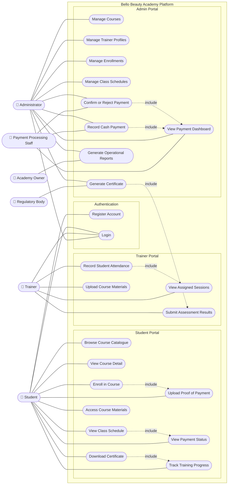
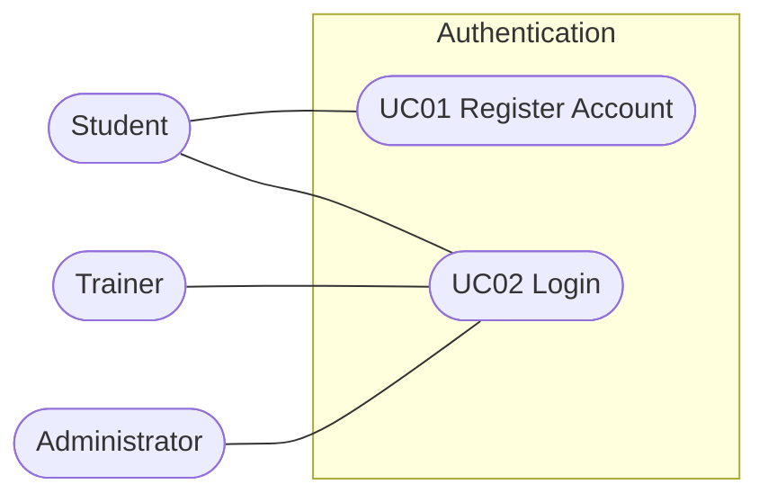
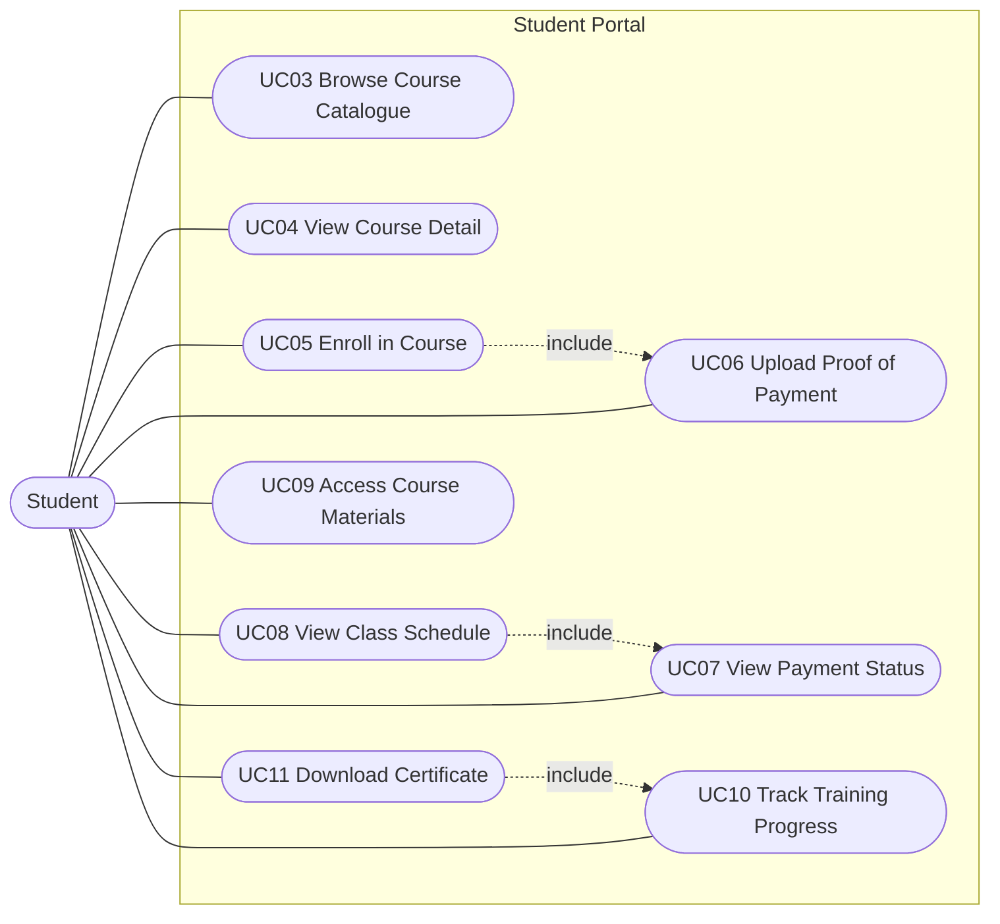
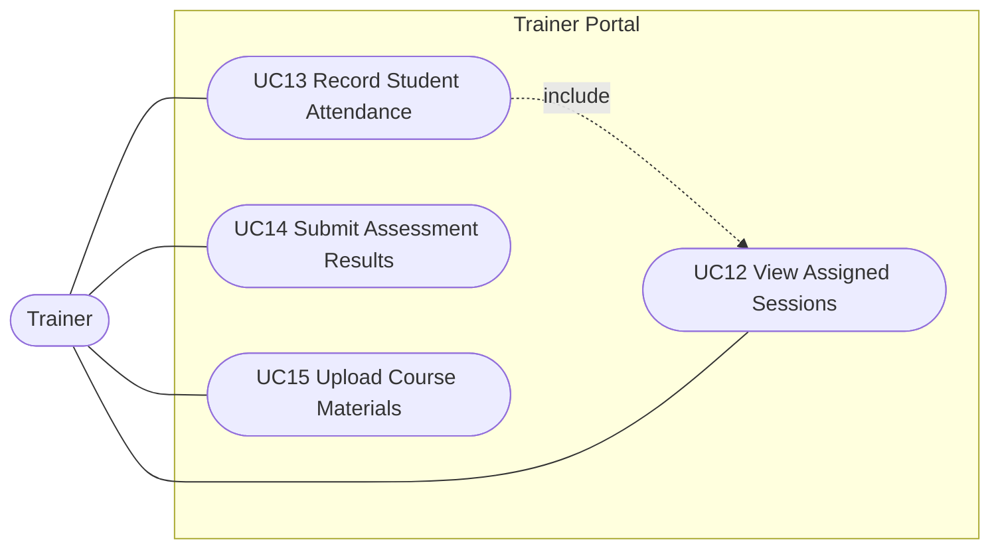

# Test and Use Case Document — Bello Beauty Academy Platform

**Document Version:** 1.0
**Date:** March 2026
**Assignment:** Assignment 5 — Test and Use Case Development
**Status:** Final

---

## Table of Contents

1. [Use Case Diagrams](#1-use-case-diagrams)
   - [Deriving Use Cases from Requirements](#1-deriving-use-cases-from-requirements)
   - [Identified Use Cases, Actors, and Subsystems](#2-identified-use-cases-actors-and-subsystems)
   - [High-Level Use Case Scope Specifications](#3-high-level-use-case-scope-specifications)
   - [Diagrams](#4-use-case-diagrams)
   - [Diagram Explanation](#5-diagram-explanation)
2. [Use Case Specifications](#2-use-case-specifications)
3. [Test Cases](#3-test-cases)

---

# 1. Use Case Diagrams

## 1. Deriving Use Cases from Requirements

Use cases are derived by reading through the functional requirements and identifying domain-specific verb-noun phrases that represent complete business processes. Each candidate phrase is then evaluated against four questions:

1. Is it a domain-specific business process?
2. Does it begin with an actor?
3. Does it end with the actor?
4. Does it accomplish a business task for the actor?

A verb-noun phrase is a use case only if all four answers are yes. Phrases that represent steps, operations, or automated background processes are excluded.

---

## 2. Identified Use Cases, Actors, and Subsystems

Use cases are grouped into subsystems based on the actor whose role they serve, using role-based partition.

### Actors

| Actor | Type | Description |
|-------|------|-------------|
| Student | Primary Actor | Registers, enrolls, uploads proof of payment, tracks progress, downloads certificates |
| Trainer | Primary Actor | Views assigned sessions, records attendance, submits assessments, uploads materials |
| Administrator | Primary Actor | Manages all operational aspects of the academy platform |
| Payment Processing Staff | Secondary Actor | Shares payment confirmation use cases with Administrator |
| Academy Owner | Secondary Actor | Views operational reports to monitor enrollment numbers and revenue |
| Regulatory / Certification Body | External Stakeholder | Has a formal interest in the Download Certificate use case to ensure certificates are traceable, verifiable, and consistently formatted |

### Use Cases by Subsystem

**Authentication** (Actors: Student, Trainer, Administrator)
- UC01 Register Account
- UC02 Login

**Student Portal** (Actor: Student)
- UC03 Browse Course Catalogue
- UC04 View Course Detail
- UC05 Enroll in Course
- UC06 Upload Proof of Payment
- UC07 View Payment Status
- UC08 View Class Schedule
- UC09 Access Course Materials
- UC10 Track Training Progress
- UC11 Download Certificate

**Trainer Portal** (Actor: Trainer)
- UC12 View Assigned Sessions
- UC13 Record Student Attendance
- UC14 Submit Assessment Results
- UC15 Upload Course Materials

**Admin Portal** (Actors: Administrator, Payment Processing Staff, Academy Owner)
- UC16 Manage Courses
- UC17 Manage Trainer Profiles
- UC18 Manage Enrollments
- UC19 Manage Class Schedules
- UC20 View Payment Dashboard
- UC21 Confirm or Reject Payment
- UC22 Record Cash Payment
- UC23 Generate Certificate
- UC24 Generate Operational Reports

---

## 3. High-Level Use Case Scope Specifications

Each use case scope is specified in two declarative sentences written in third-person simple present tense: one stating when and where the use case begins, and one stating when it ends and what the actor has accomplished.

| UC ID | Use Case | This Use Case Begins With | This Use Case Ends With |
|-------|----------|--------------------------|------------------------|
| UC01 | Register Account | This use case begins with a prospective student clicking the Register link on the platform home page. | This use case ends with the student seeing a confirmation message that their account has been created and a confirmation email has been sent. |
| UC02 | Login | This use case begins with a user clicking the Login button on the platform home page and entering their credentials. | This use case ends with the user seeing their role-specific dashboard. |
| UC03 | Browse Course Catalogue | This use case begins with a student clicking the Courses link on their dashboard. | This use case ends with the student seeing a listing of all available training courses organised by category. |
| UC04 | View Course Detail | This use case begins with a student clicking the View Detail link for a course in the catalogue. | This use case ends with the student seeing the full course details including name, description, duration, prerequisites, and cost. |
| UC05 | Enroll in Course | This use case begins with a student clicking the Enroll button on a course detail page. | This use case ends with the student seeing a confirmation message that their enrollment application has been received and instructions to upload proof of payment. |
| UC06 | Upload Proof of Payment | This use case begins with a student clicking the Upload Proof of Payment button on their enrollment dashboard. | This use case ends with the student seeing a confirmation message that their document has been received and is under review. |
| UC07 | View Payment Status | This use case begins with a student clicking the My Enrollments link on their dashboard. | This use case ends with the student seeing their current payment status for each enrolled course. |
| UC08 | View Class Schedule | This use case begins with a student clicking the My Schedule link on their dashboard. | This use case ends with the student seeing a chronological listing of upcoming sessions including date, time, venue, and trainer name. |
| UC09 | Access Course Materials | This use case begins with a student clicking the Course Materials link for an active enrollment. | This use case ends with the student seeing all uploaded materials for the course and being able to download them. |
| UC10 | Track Training Progress | This use case begins with a student clicking the My Progress link for an active enrollment. | This use case ends with the student seeing a session-by-session record of their attendance and assessment results. |
| UC11 | Download Certificate | This use case begins with a student clicking the Download Certificate button on a completed enrollment record. | This use case ends with the student receiving their branded PDF certificate containing their name, course name, completion date, and unique certificate number. |
| UC12 | View Assigned Sessions | This use case begins with a trainer clicking the My Sessions link on their trainer portal. | This use case ends with the trainer seeing a listing of all upcoming and past sessions assigned to them. |
| UC13 | Record Student Attendance | This use case begins with a trainer clicking the Record Attendance button for an assigned session. | This use case ends with the trainer seeing a confirmation that attendance records have been saved for all enrolled students. |
| UC14 | Submit Assessment Results | This use case begins with a trainer clicking the Submit Assessment button for a student in an assigned course. | This use case ends with the trainer seeing a confirmation that the result has been saved and is visible on the student's progress dashboard. |
| UC15 | Upload Course Materials | This use case begins with a trainer clicking the Upload Material button for an assigned course. | This use case ends with the trainer seeing a confirmation that the material is uploaded and accessible to enrolled students. |
| UC16 | Manage Courses | This use case begins with an administrator clicking the Manage Courses link on the admin dashboard. | This use case ends with the administrator seeing the updated course catalogue reflecting the changes made. |
| UC17 | Manage Trainer Profiles | This use case begins with an administrator clicking the Manage Trainers link on the admin dashboard. | This use case ends with the administrator seeing the updated trainer profile list reflecting the changes made. |
| UC18 | Manage Enrollments | This use case begins with an administrator clicking the Manage Enrollments link on the admin dashboard. | This use case ends with the administrator seeing the updated enrollment list with the new status applied. |
| UC19 | Manage Class Schedules | This use case begins with an administrator clicking the Manage Schedules link on the admin dashboard. | This use case ends with the administrator seeing the updated session schedule published and visible to enrolled students. |
| UC20 | View Payment Dashboard | This use case begins with an administrator clicking the Payment Dashboard link on the admin dashboard. | This use case ends with the administrator seeing all enrollments grouped by payment status with confirm, reject, and view POP actions available. |
| UC21 | Confirm or Reject Payment | This use case begins with an administrator clicking the View POP button for a pending payment on the payment dashboard. | This use case ends with the administrator seeing the payment status updated and the student notified by email. |
| UC22 | Record Cash Payment | This use case begins with an administrator clicking the Record Cash Payment button for a student enrollment on the payment dashboard. | This use case ends with the administrator seeing the payment status set to confirmed and the enrollment status updated to active. |
| UC23 | Generate Certificate | This use case begins with an administrator clicking the Generate Certificate button for a student's completed enrollment. | This use case ends with the administrator seeing a confirmation that the certificate has been generated, stored, and the student has been notified. |
| UC24 | Generate Operational Reports | This use case begins with an administrator clicking the Reports link and selecting a report type and date range. | This use case ends with the administrator seeing the generated report and being able to export it in CSV format. |

---

## 4. Use Case Diagrams

Use cases are first presented in a high-level overview diagram showing all actors and use cases in a single view, followed by four partitioned subsystem diagrams that break the system down by actor role for clarity.

### Diagram 0: High-Level System Overview

---

### Partitioned Subsystem Diagrams

The system is partitioned into four role-based subsystems below. Each diagram isolates one actor domain to improve readability and functional cohesion.

---

### Diagram 1: Authentication

### Diagram 2: Student Portal

### Diagram 3: Trainer Portal

### Diagram 4: Admin Portal

```mermaid
graph LR
    Admin([Administrator])
    PayStaff([Payment Processing Staff])
    Owner([Academy Owner])
    RegBody([Regulatory / Certification Body])

    subgraph Admin Portal
        UC16([UC16 Manage Courses])
        UC17([UC17 Manage Trainer Profiles])
        UC18([UC18 Manage Enrollments])
        UC19([UC19 Manage Class Schedules])
        UC20([UC20 View Payment Dashboard])
        UC21([UC21 Confirm or Reject Payment])
        UC22([UC22 Record Cash Payment])
        UC23([UC23 Generate Certificate])
        UC24([UC24 Generate Operational Reports])

        UC21 -.->|include| UC20
        UC22 -.->|include| UC20
        UC23 -.->|include| UC14
    end

    Admin --- UC16
    Admin --- UC17
    Admin --- UC18
    Admin --- UC19
    Admin --- UC20
    Admin --- UC21
    Admin --- UC22
    Admin --- UC23
    Admin --- UC24
    PayStaff --- UC20
    PayStaff --- UC21
    PayStaff --- UC22
    Owner --- UC24
    RegBody --- UC23
```

---

## 5. Diagram Explanation

### Key Actors and Their Roles

#### Student
The Student is the primary end user of the platform. They initiate the majority of the core use cases, including browsing courses, enrolling, uploading proof of payment, tracking their training progress, and downloading their digital certificate on course completion.

#### Trainer
The Trainer is a qualified beauty professional who interacts with the system through a dedicated trainer portal. They view their assigned sessions, record student attendance, submit competency assessment results, and upload course materials for enrolled students.

#### Administrator
The Administrator has the broadest system access of all user roles. They manage all operational aspects of the platform including the course catalogue, trainer profiles, student enrollments, class schedules, payment verification, certificate generation, and operational reporting.

#### Payment Processing Staff
The Payment Processing Staff shares access to the payment-related use cases with the Administrator. They review uploaded proof of payment documents, confirm or reject payments, and record cash payments against student enrollments. In a small academy this role may be performed by the same person as the Administrator.

#### Academy Owner
The Academy Owner interacts with the system solely through the Generate Operational Reports use case. This gives them visibility into enrollment numbers, course completion rates, and revenue without direct involvement in day-to-day operations.

#### Regulatory / Certification Body
The Regulatory / Certification Body is an external stakeholder with a formal interest in the Generate Certificate use case. They do not log in or operate the platform directly, but every certificate the system produces must meet their traceability and formatting standards to be recognised as a valid industry credential.

---

### Relationships Between Actors and Use Cases

**Association relationships** connect every actor to the use cases they can initiate. For example, the Student actor can initiate the Enroll in Course use case, the View Class Schedule use case, and the Download Certificate use case, among others. The Administrator actor can initiate all use cases within the Admin Portal subsystem including Confirm or Reject Payment and Generate Certificate.

**Include relationships** are shown where one use case is a mandatory part of another's business process — the included use case must always be executed as part of the base use case.

- The **Student** actor initiates the **Enroll in Course** use case, which includes the **Upload Proof of Payment** use case. This means every enrollment automatically requires the student to submit proof of payment. This addresses the student stakeholder's pain point around informal enrollment with no structured payment submission process.
- The **Student** actor initiates the **View Class Schedule** use case, which includes the **View Payment Status** use case. The schedule is only accessible once payment has been confirmed, so the system checks payment status as part of this process. This supports the administrator's concern that students should not access course content before payment is verified.
- The **Student** actor initiates the **Download Certificate** use case, which includes the **Track Training Progress** use case. The system verifies course completion via progress records before presenting the certificate download option. This supports the regulatory body's concern that certificates are only issued to students who have genuinely completed the course.
- The **Trainer** actor initiates the **Record Student Attendance** use case, which includes the **View Assigned Sessions** use case. A trainer must have navigated to their session view before recording attendance for a specific session.
- The **Administrator** actor initiates the **Confirm or Reject Payment** use case, which includes the **View Payment Dashboard** use case. The administrator must be on the payment dashboard before they can access an individual payment for review.
- The **Administrator** actor initiates the **Record Cash Payment** use case, which also includes the **View Payment Dashboard** use case, as this action also begins from the payment dashboard.
- The **Administrator** actor initiates the **Generate Certificate** use case, which includes the **Submit Assessment Results** use case. All trainer assessments must be submitted before a certificate can be generated, ensuring that certificates are only issued to students who have been formally assessed.

**Generalisation** exists between the Administrator and Payment Processing Staff actors. Both actors share access to the View Payment Dashboard, Confirm or Reject Payment, and Record Cash Payment use cases. This reflects the reality that payment processing responsibilities are a specialised subset of the administrator role, and in a small academy the same person may perform both functions.

---

### How the Diagrams Address Stakeholder Concerns from Assignment 4

The use case model directly addresses the stakeholder concerns and pain points identified in [STAKEHOLDER_ANALYSIS.md](./STAKEHOLDER_ANALYSIS.md).

The Student Portal subsystem resolves the student stakeholder's most significant pain points: the absence of a central course browsing platform (Browse Course Catalogue), the informal WhatsApp-based enrollment process (Enroll in Course), the lack of payment status visibility (View Payment Status), and the unavailability of digital certificates (Download Certificate).

The Trainer Portal subsystem resolves the trainer stakeholder's pain points around informal session communication (View Assigned Sessions) and paper-based attendance registers (Record Student Attendance).

The Admin Portal subsystem resolves the academy administrator's most critical operational pain point — the complete absence of a structured payment tracking system. The View Payment Dashboard, Confirm or Reject Payment, and Record Cash Payment use cases replace the existing WhatsApp-based proof of payment workflow with a systematic, auditable digital process. This directly addresses the concern raised by both the administrator and payment processing staff stakeholders.

The Requirements-Use Case Traceability Matrix in Section 5 confirms that every functional requirement from Assignment 4 is realised by at least one use case, and that every use case is justified by at least one requirement. No requirement is left unaddressed and no use case is included without justification.

---

---

# 2. Use Case Specifications

## UC01 — Register Account

| Field | Detail |
|-------|--------|
| **Use Case ID** | UC01 |
| **Use Case Name** | Register Account |
| **Actor** | Student |
| **Subsystem** | Authentication |
| **Related Requirement** | FR01 |
| **Priority** | 1 (Highest) |

**High-Level Scope:**
> **This use case begins with** a prospective student clicking the Register link on the platform home page.
> **This use case ends with** the student seeing a confirmation message that their account has been created and a confirmation email has been dispatched.

**Description:**
A prospective student creates a personal account on the Bello Beauty Academy Platform by providing their full name, email address, and a password. This use case is the entry point for all subsequent student interactions with the system and must be completed before a student can enroll in any course.

**Preconditions:**
- The user has navigated to the platform home page.
- The user has not previously registered with the provided email address.
- The user has access to a web browser and an active internet connection.

**Postconditions:**
- A new user record is created in the database with role `student`.
- The password is stored as a bcrypt hash; no plain-text password is persisted.
- A confirmation email is dispatched to the registered email address within 60 seconds.
- The student is redirected to their personal dashboard.

**Basic Flow:**
1. The student clicks the Register link on the platform home page.
2. The system displays the registration form.
3. The student enters their full name, email address, and a password of at least 8 characters.
4. The student clicks the Submit button.
5. The system validates that all fields are completed and the email address is in a valid format.
6. The system checks that the email address is not already registered.
7. The system creates a new user record with role `student` and stores the bcrypt-hashed password.
8. The system dispatches a confirmation email to the registered email address.
9. The system displays: "Your account has been created successfully." and redirects the student to their dashboard.

**Alternative Flows:**

*AF01 — Duplicate Email Address:*
At step 6, if the email address is already registered in the system, the system displays: "An account with this email address already exists. Please log in or use a different email address." The form is not submitted and the student remains on the registration page.

*AF02 — Invalid Email Format:*
At step 5, if the email address does not conform to a valid format, the system displays an inline validation message: "Please enter a valid email address."

*AF03 — Password Too Short:*
At step 5, if the password contains fewer than 8 characters, the system displays: "Your password must be at least 8 characters long."

---

## UC05 — Enroll in Course

| Field | Detail |
|-------|--------|
| **Use Case ID** | UC05 |
| **Use Case Name** | Enroll in Course |
| **Actor** | Student |
| **Subsystem** | Student Portal |
| **Related Requirement** | FR05, FR11 |
| **Priority** | 1 (Highest) |

**High-Level Scope:**
> **This use case begins with** a student clicking the Enroll button on a course detail page.
> **This use case ends with** the student seeing a confirmation message that their enrollment application has been received and instructions to upload their proof of payment.

**Description:**
An authenticated student submits an enrollment application for a selected training course. This is a business process that begins with the student's deliberate action to enroll and ends when the system confirms receipt of the application. This use case includes UC06 (Upload Proof of Payment) because enrollment always triggers the requirement to submit payment evidence.

**Preconditions:**
- The student is authenticated with a valid session (JWT with role `student`).
- The selected course exists in the system with status `active`.
- The student is not already enrolled in the selected course.

**Postconditions:**
- An enrollment record is created in the database with status `pending`.
- A linked payment record is created with status `pending`.
- An automated enrollment confirmation email is dispatched to the student within 60 seconds, containing the course name, enrollment date, and instructions for submitting proof of payment.

**Basic Flow:**
1. The student browses the course catalogue and selects a course to view in detail.
2. The student clicks the Enroll button on the course detail page.
3. The system checks that the student is authenticated.
4. The system checks that the selected course has status `active`.
5. The system checks that the student is not already enrolled in the selected course.
6. The system creates an enrollment record with status `pending`.
7. The system creates a linked payment record with status `pending`.
8. The system dispatches an automated confirmation email to the student.
9. The system displays: "Your enrollment application has been received. Please upload your proof of payment to complete your enrollment."

**Alternative Flows:**

*AF01 — Student Not Authenticated:*
At step 3, if the student does not have a valid active session, the system redirects them to the login page. After successful login, the student is returned to the course detail page.

*AF02 — Duplicate Enrollment:*
At step 5, if the student is already enrolled in the selected course, the system returns an HTTP 409 response and displays: "You are already enrolled in this course."

*AF03 — Course Inactive:*
At step 4, if the selected course has been deactivated by an administrator, the Enroll button is not displayed on the course detail page.

---

## UC06 — Upload Proof of Payment

| Field | Detail |
|-------|--------|
| **Use Case ID** | UC06 |
| **Use Case Name** | Upload Proof of Payment |
| **Actor** | Student |
| **Subsystem** | Student Portal |
| **Related Requirement** | FR06 |
| **Priority** | 1 (Highest) |

**High-Level Scope:**
> **This use case begins with** a student clicking the Upload Proof of Payment button on their enrollment dashboard.
> **This use case ends with** the student seeing a confirmation message that their document has been received and is under review by the administrator.

**Description:**
An authenticated student uploads a proof of payment document (bank slip or EFT screenshot) against a pending enrollment. The uploaded file is stored securely in cloud storage and triggers an automated notification to the administrator for review.

**Preconditions:**
- The student is authenticated with a valid session.
- The student has an enrollment record with status `pending`.
- A linked payment record exists with status `pending`.

**Postconditions:**
- The uploaded file is stored in the private AWS S3 bucket.
- The S3 file path is recorded in the payment record.
- The student sees an on-screen confirmation.
- An automated notification is dispatched to the administrator indicating a new proof of payment is awaiting review.

**Basic Flow:**
1. The student navigates to the enrollment dashboard.
2. The student clicks the Upload Proof of Payment button next to the pending enrollment.
3. The system displays a file upload interface.
4. The student selects a file from their device (JPEG, PNG, or PDF, maximum 5 MB).
5. The student clicks Submit.
6. The system validates the file type and size.
7. The system uploads the file to the private AWS S3 bucket.
8. The system records the S3 file path in the payment record.
9. The system displays: "Your proof of payment has been received and is under review."
10. The system dispatches an automated notification to the administrator.

**Alternative Flows:**

*AF01 — Invalid File Type:*
At step 6, if the selected file is not JPEG, PNG, or PDF, the system displays: "Only JPEG, PNG, and PDF files are accepted." The file is not uploaded.

*AF02 — File Too Large:*
At step 6, if the file exceeds 5 MB, the system displays: "Your file exceeds the maximum allowed size of 5 MB. Please reduce the file size and try again."

*AF03 — Upload Failure:*
At step 7, if the S3 upload fails due to a network or service error, the system displays: "Your file could not be uploaded at this time. Please try again." No file path is recorded and no notification is sent.

---

## UC11 — Download Certificate

| Field | Detail |
|-------|--------|
| **Use Case ID** | UC11 |
| **Use Case Name** | Download Certificate |
| **Actor** | Student |
| **Subsystem** | Student Portal |
| **Related Requirement** | FR10 |
| **Priority** | 2 |

**High-Level Scope:**
> **This use case begins with** a student clicking the Download Certificate button on a completed enrollment record on their dashboard.
> **This use case ends with** the student receiving their branded PDF certificate containing their full name, course name, completion date, and unique certificate number.

**Description:**
An authenticated student downloads their digital certificate in PDF format once it has been generated and issued by the administrator. This use case includes UC10 (Track Training Progress) because the system verifies course completion via progress records before presenting the download option.

**Preconditions:**
- The student is authenticated with a valid session.
- The administrator has generated and issued a certificate for the student's completed course enrollment.
- A certificate metadata record exists in the `certificates` table for the student and course.

**Postconditions:**
- The PDF certificate is streamed to the student's browser for download.
- The downloaded PDF contains the student's full name, course name, completion date, and unique certificate number.
- No database records are modified by the download action.

**Basic Flow:**
1. The student navigates to their enrollment dashboard.
2. The system displays completed enrollments with a Download Certificate button where a certificate has been issued.
3. The student clicks the Download Certificate button.
4. The system retrieves the certificate metadata record from the `certificates` table.
5. The system generates a time-limited presigned URL pointing to the PDF in the private S3 bucket.
6. The PDF is streamed to the student's browser for download.

**Alternative Flows:**

*AF01 — Certificate Not Yet Issued:*
At step 2, if the administrator has not yet generated a certificate for the completed enrollment, the Download Certificate button is not displayed. The enrollment shows a status of `completed` or `active` without a download option.

*AF02 — File Retrieval Failure:*
At step 5, if the S3 file cannot be retrieved, the system displays: "Your certificate could not be downloaded at this time. Please try again or contact the academy."

---

## UC13 — Record Student Attendance

| Field | Detail |
|-------|--------|
| **Use Case ID** | UC13 |
| **Use Case Name** | Record Student Attendance |
| **Actor** | Trainer |
| **Subsystem** | Trainer Portal |
| **Related Requirement** | FR15 |
| **Priority** | 1 (Highest) |

**High-Level Scope:**
> **This use case begins with** a trainer clicking the Record Attendance button for an assigned session on their trainer portal.
> **This use case ends with** the trainer seeing a confirmation that attendance records have been saved for all enrolled students in that session.

**Description:**
An authenticated trainer records the attendance status of each enrolled student for a training session they are assigned to. Attendance records are stored with an audit timestamp and the trainer's user ID. This use case includes UC12 (View Assigned Sessions) because the trainer must have navigated to their session view before recording attendance.

**Preconditions:**
- The trainer is authenticated with a valid session (JWT with role `trainer`).
- The session exists in the system and is assigned to the authenticated trainer.
- The session date has occurred or falls within the 24-hour post-session recording window.

**Postconditions:**
- An attendance record is created or updated for each enrolled student for the given session.
- Each record contains the attendance status (Present, Absent, or Late), the trainer's user ID, and a submission timestamp.
- Attendance records are immediately reflected on each student's progress dashboard.

**Basic Flow:**
1. The trainer logs in and navigates to their session list on the trainer portal.
2. The trainer selects the session for which they wish to record attendance.
3. The system displays the list of enrolled students for that session.
4. The trainer sets an attendance status of Present, Absent, or Late for each student.
5. The trainer clicks Save Attendance.
6. The system saves each attendance record with the trainer's user ID and a timestamp.
7. The system displays: "Attendance has been saved successfully." and updates the student progress dashboards.

**Alternative Flows:**

*AF01 — Recording Window Expired:*
At step 2, if more than 24 hours have passed since the session end time, the system displays: "The attendance recording window for this session has closed." The trainer cannot submit attendance for that session.

*AF02 — No Students Enrolled:*
At step 3, if no students are enrolled in the session, the system displays: "There are no enrolled students for this session."

*AF03 — Incomplete Submission:*
At step 5, if one or more students have not been assigned an attendance status, the system displays: "Please set an attendance status for all students before saving."

---

## UC14 — Submit Assessment Results

| Field | Detail |
|-------|--------|
| **Use Case ID** | UC14 |
| **Use Case Name** | Submit Assessment Results |
| **Actor** | Trainer |
| **Subsystem** | Trainer Portal |
| **Related Requirement** | FR16 |
| **Priority** | 2 |

**High-Level Scope:**
> **This use case begins with** a trainer clicking the Submit Assessment button for a student in an assigned course on their portal.
> **This use case ends with** the trainer seeing a confirmation that the assessment result has been saved and is now visible on the student's progress dashboard.

**Description:**
An authenticated trainer submits a competency assessment result for an enrolled student in a course they are assigned to. Assessment results are required before an administrator can generate a certificate for the student (UC23 includes this use case).

**Preconditions:**
- The trainer is authenticated with a valid session.
- The student has an active enrollment in the course assigned to the trainer.
- The trainer is explicitly assigned to the course in which the assessment is being submitted.

**Postconditions:**
- An assessment record is created in the database containing the student ID, course ID, competency rating, optional comment, trainer user ID, and submission timestamp.
- The result is immediately visible on the student's progress dashboard.

**Basic Flow:**
1. The trainer navigates to the student list for an assigned course on their portal.
2. The trainer selects a student to assess.
3. The system displays the assessment submission form.
4. The trainer enters a competency rating and an optional free-text comment.
5. The trainer clicks Submit Assessment.
6. The system saves the assessment record with the trainer's user ID and a timestamp.
7. The system displays: "Assessment submitted successfully." and updates the student's progress dashboard.

**Alternative Flows:**

*AF01 — No Active Enrollment:*
At step 2, if the selected student does not have an active enrollment in the course, the system displays: "This student does not have an active enrollment in this course."

*AF02 — Missing Competency Rating:*
At step 5, if no competency rating has been provided, the system displays: "Please provide a competency rating before submitting."

---

## UC21 — Confirm or Reject Payment

| Field | Detail |
|-------|--------|
| **Use Case ID** | UC21 |
| **Use Case Name** | Confirm or Reject Payment |
| **Actor** | Administrator, Payment Processing Staff |
| **Subsystem** | Admin Portal |
| **Related Requirement** | FR25, FR27 |
| **Priority** | 1 (Highest) |

**High-Level Scope:**
> **This use case begins with** an administrator clicking the View POP button for a pending payment on the payment dashboard.
> **This use case ends with** the administrator seeing the payment status updated to confirmed or rejected, and the student notified by automated email.

**Description:**
An authenticated administrator or payment processing staff member reviews a student's uploaded proof of payment document and either confirms or rejects it. Confirming a payment activates the student's enrollment and triggers an email notification. Rejecting a payment prompts the student to resubmit. This use case includes UC20 (View Payment Dashboard) because the administrator must be on the payment dashboard before they can access an individual payment for review.

**Preconditions:**
- The administrator or payment processing staff is authenticated with a valid session.
- A student has submitted a proof of payment document with payment status `pending`.

**Postconditions (Confirmation):**
- The payment status is updated to `confirmed`.
- The enrollment status is updated to `active`.
- An automated confirmation email is dispatched to the student within 60 seconds.
- The confirmation is logged with the staff member's user ID and a timestamp.

**Postconditions (Rejection):**
- The payment status is updated to `rejected`.
- An automated rejection email is dispatched to the student prompting resubmission.
- The rejection is logged with the staff member's user ID and a timestamp.

**Basic Flow:**
1. The administrator opens the payment dashboard and views all pending payments.
2. The administrator selects a pending payment and clicks View POP.
3. The system retrieves the uploaded file from the private S3 bucket via a presigned URL and opens it for viewing.
4. The administrator reviews the document.
5. The administrator clicks Confirm Payment.
6. The system updates the payment status to `confirmed` and the enrollment status to `active`.
7. The system logs the confirmation with the administrator's user ID and timestamp.
8. The system dispatches an automated confirmation email to the student.
9. The system displays: "Payment confirmed. The student's enrollment is now active."

**Alternative Flows:**

*AF01 — Administrator Rejects Payment:*
At step 5, the administrator clicks Reject Payment instead of Confirm Payment.
- The system updates the payment status to `rejected`.
- The system logs the rejection with the administrator's user ID and timestamp.
- The system dispatches a rejection email to the student with instructions to resubmit their proof of payment.
- The system displays: "Payment rejected. The student has been notified."

*AF02 — POP File Not Accessible:*
At step 3, if the S3 file cannot be retrieved, the system displays: "The proof of payment document could not be loaded. Please try again." No status change is made until the document has been successfully reviewed.

---

## UC23 — Generate Certificate

| Field | Detail |
|-------|--------|
| **Use Case ID** | UC23 |
| **Use Case Name** | Generate Certificate |
| **Actor** | Administrator |
| **Subsystem** | Admin Portal |
| **Related Requirement** | FR22 |
| **Priority** | 2 |

**High-Level Scope:**
> **This use case begins with** an administrator clicking the Generate Certificate button for a student's completed enrollment.
> **This use case ends with** the administrator seeing a confirmation that the certificate has been generated, stored, and the student has been notified by email.

**Description:**
An authenticated administrator generates and issues a branded digital PDF certificate for a student who has successfully completed a course. This use case includes UC14 (Submit Assessment Results) because all competency assessments must be submitted by the trainer before a certificate can be generated.

**Preconditions:**
- The administrator is authenticated with a valid session.
- The student's enrollment status is `active` for the selected course.
- All competency assessments for the enrollment have been submitted by the trainer.
- A certificate has not already been issued for this student and course combination.

**Postconditions:**
- A branded PDF certificate is generated containing the student's full name, course name, completion date, academy logo, and a unique certificate number.
- The PDF is stored in the private AWS S3 bucket.
- A certificate metadata record is created in the `certificates` table with the student ID, course ID, issue date, unique certificate number, and S3 file path.
- The enrollment status is updated to `completed`.
- A certificate-ready email is dispatched to the student containing a download link.

**Basic Flow:**
1. The administrator navigates to the student's enrollment record on the admin dashboard.
2. The system displays the enrollment details and shows that all assessments have been submitted.
3. The administrator clicks Generate Certificate.
4. The system verifies that all assessments are submitted for the enrollment.
5. The system generates the branded PDF certificate with a unique certificate number.
6. The system stores the PDF in the private AWS S3 bucket.
7. The system creates a certificate metadata record in the `certificates` table.
8. The system updates the enrollment status to `completed`.
9. The system dispatches a certificate-ready email to the student.
10. The system displays: "Certificate generated and issued successfully."

**Alternative Flows:**

*AF01 — Assessments Incomplete:*
At step 4, if one or more competency assessments have not been submitted for the enrollment, the system displays: "All competency assessments must be submitted by the trainer before a certificate can be generated." The Generate Certificate button is disabled until all assessments are complete.

*AF02 — Certificate Already Issued:*
At step 3, if a certificate record already exists for this student and course combination, the system displays: "A certificate has already been issued for this enrollment." and provides a link to the existing certificate.

---

---

# 3. Test Cases

## 1. Functional Test Cases

| Test Case ID | Requirement ID | Description | Steps | Expected Result | Actual Result | Status (Pass/Fail) |
|---|---|---|---|---|---|---|
| TC001 | FR01 | Student registers a new account with valid details | 1. Navigate to the registration page.   2. Enter a valid full name, email address, and password of at least 8 characters.   3. Click Submit. | A student account is created in the database with role `student`. The student is redirected to their personal dashboard. A confirmation email is dispatched within 60 seconds. | — | — |
| TC002 | FR01 | Registration rejected when email address already exists | 1. Navigate to the registration page.   2. Enter an email address that is already registered in the system.   3. Click Submit. | The system displays: "An account with this email address already exists." No new record is created in the database. The student remains on the registration page. | — | — |
| TC003 | FR02 | Registered student logs in with valid credentials | 1. Navigate to the login page.   2. Enter a valid registered student email and correct password.   3. Click Login. | The system issues a JWT with role `student`. The student is redirected to their personal dashboard. | — | — |
| TC004 | FR02 | Login rejected when incorrect password is entered | 1. Navigate to the login page.   2. Enter a valid registered email with an incorrect password.   3. Click Login. | The system returns HTTP 401. A generic error message is displayed. No JWT is issued and no session is created. | — | — |
| TC005 | FR05 | Student successfully enrolls in an active course | 1. Log in as a registered student.   2. Navigate to the course catalogue and select an active course.   3. Click View Detail.   4. Click Enroll. | An enrollment record is created with status `pending`. A linked payment record is created with status `pending`. An automated confirmation email is dispatched to the student within 60 seconds including the course name and payment instructions. | — | — |
| TC006 | FR05 | Enrollment rejected when student is already enrolled in that course | 1. Log in as a student who is already enrolled in a specific course.   2. Navigate to the same course detail page.   3. Attempt to click Enroll. | The system returns HTTP 409 and displays: "You are already enrolled in this course." No duplicate enrollment record is created. | — | — |
| TC007 | FR06 | Student uploads a valid proof of payment document | 1. Log in as a student with a pending enrollment.   2. Navigate to the enrollment dashboard.   3. Click Upload Proof of Payment.   4. Select a valid PDF file under 5 MB.   5. Click Submit. | The file is stored in the private AWS S3 bucket. The S3 file path is recorded in the payment record. The student sees a confirmation message. An automated notification is dispatched to the administrator. | — | — |
| TC008 | FR06 | Proof of payment upload rejected for unsupported file type | 1. Log in as a student with a pending enrollment.   2. Navigate to the enrollment dashboard.   3. Click Upload Proof of Payment.   4. Select a file in an unsupported format (e.g., .xlsx).   5. Click Submit. | The system displays: "Only JPEG, PNG, and PDF files are accepted." No file is uploaded. No payment record is updated. | — | — |
| TC009 | FR15 | Trainer records attendance for all students in an assigned session | 1. Log in as a trainer.   2. Navigate to an assigned session within the 24-hour recording window.   3. Set an attendance status of Present, Absent, or Late for each enrolled student.   4. Click Save Attendance. | Attendance records are saved for all students. Each record contains the attendance status, the trainer's user ID, and a submission timestamp. Records are immediately reflected on student progress dashboards. | — | — |
| TC010 | FR25 | Administrator confirms a student proof of payment | 1. Log in as an administrator.   2. Open the payment dashboard.   3. Select a pending payment and click View POP.   4. Review the document.   5. Click Confirm Payment. | Payment status is updated to `confirmed`. Enrollment status is updated to `active`. A confirmation email is dispatched to the student within 60 seconds. The action is logged with the administrator's user ID and a timestamp. | — | — |
| TC011 | FR25 | Administrator rejects a student proof of payment | 1. Log in as an administrator.   2. Open the payment dashboard.   3. Select a pending payment and click Reject Payment. | Payment status is updated to `rejected`. A rejection email is dispatched to the student with instructions to resubmit their proof of payment. The action is logged with the administrator's user ID and a timestamp. | — | — |
| TC012 | FR22 | Administrator generates a certificate for a completed enrollment | 1. Log in as an administrator.   2. Navigate to a student enrollment where all competency assessments have been submitted.   3. Click Generate Certificate. | A branded PDF certificate is generated containing the student's full name, course name, completion date, and a unique certificate number. The PDF is stored in S3. A metadata record is created in the `certificates` table. The enrollment status is updated to `completed`. A certificate-ready email is dispatched to the student. | — | — |
| TC013 | FR22 | Certificate generation blocked when assessments are incomplete | 1. Log in as an administrator.   2. Navigate to a student enrollment where one or more assessments have not been submitted by the trainer.   3. Attempt to click Generate Certificate. | The system displays: "All competency assessments must be submitted by the trainer before a certificate can be generated." No certificate is created. The Generate Certificate button is disabled until all assessments are complete. | — | — |
| TC014 | FR10 | Student downloads their issued certificate | 1. Log in as a student with a completed enrollment and an issued certificate.   2. Navigate to the enrollment dashboard.   3. Click Download Certificate. | The system generates a presigned S3 URL for the PDF. The PDF is streamed to the student's browser for download. The downloaded file contains the student's full name, course name, completion date, and unique certificate number. | — | — |

---

## 2. Non-Functional Test Cases

### NFT001 — Performance Test: API Response Time Under Concurrent Load

| Test Case ID | Requirement ID | Description | Steps | Expected Result | Actual Result | Status (Pass/Fail) |
|---|---|---|---|---|---|---|
| NFT001 | NFR-P02, NFR-S01 | Simulate 100 concurrent authenticated users performing read operations to verify the system maintains response times within defined thresholds | 1. Configure a load testing tool (Apache JMeter or k6) with 100 virtual users.   2. Each virtual user authenticates and receives a valid JWT.   3. Each user sends requests to: `GET /api/courses`, `GET /api/enrollments/:studentId`, `GET /api/sessions/:studentId`.   4. Run the test for 5 minutes.   5. Record P95 response time for each endpoint. | P95 response time for all endpoints remains under 500 milliseconds throughout the 5-minute test. No HTTP 500 errors occur. The system remains stable and does not restart under load. | — | — |

### NFT002 — Security Test: Role-Based Access Control and Token Expiry Enforcement

| Test Case ID | Requirement ID | Description | Steps | Expected Result | Actual Result | Status (Pass/Fail) |
|---|---|---|---|---|---|---|
| NFT002A | NFR-SEC03 | Verify that a student JWT cannot access administrator-only API endpoints | 1. Authenticate as a registered student and obtain a valid JWT with role `student`.   2. Send `GET /api/payments` using the student JWT.   3. Send `POST /api/certificates/:studentId/:courseId` using the student JWT.   4. Send `GET /api/reports` using the student JWT.   5. Record the HTTP response code and body for each request. | All three requests return HTTP 403 Forbidden. No data is returned in the response body. No administrative action is performed on the system. | — | — |
| NFT002B | NFR-SEC04 | Verify that expired JWT tokens are rejected with HTTP 401 | 1. Obtain a valid JWT for any user role.   2. Manually modify the token expiry claim (`exp`) to a past Unix timestamp.   3. Send `GET /api/enrollments` using the expired token.   4. Record the HTTP response code. | The system returns HTTP 401 Unauthorised. The response body contains a message indicating the session has expired. No data is returned and no action is performed. | — | — |

---

---

*End of Test and Use Case Document*